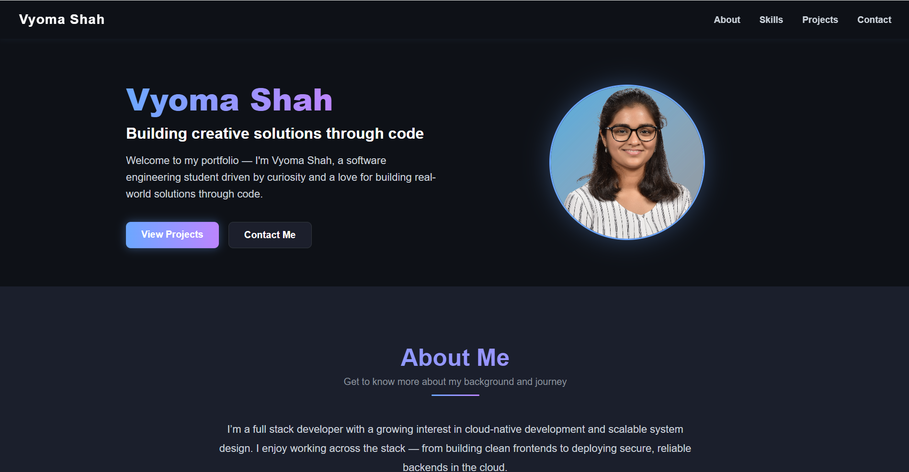

# Portfolio Website

This is the source code for my personal portfolio website built using **React.js**.

## 🚀 Tech Stack

- React.js
- HTML5, CSS3
- JavaScript (ES6+)
- Responsive Design (Flexbox/Grid)

## 📁 Folder Structure
```plaintext
vyoma-portfolio/
├── public/         # Static assets like index.html, favicon, etc.
├── src/            # React components, styles, assets, and logic
├── .gitignore
└── README.md
```
## 📸 Preview

  
## 💡 Features

- Modern, responsive UI
- Project cards with GitHub links and tech stack tags
- Smooth scrolling navigation
---

> !This repo intentionally excludes `build/` and `node_modules/` for clarity. Only `src/` and `public/` folders are tracked.
